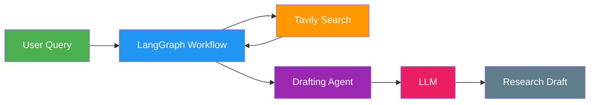
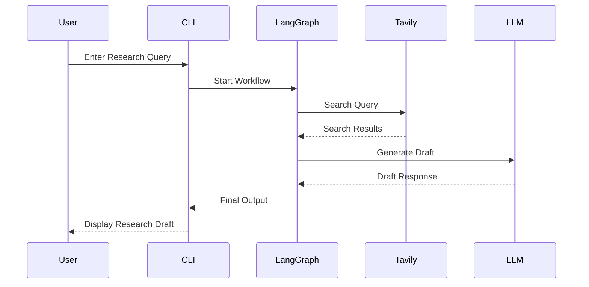
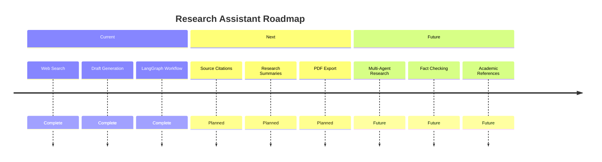

# 🔬 Research Assistant AI with LangGraph & LangChain

An intelligent research assistant that automates information gathering, web research, and draft generation using **LangGraph**, **LangChain**, and modern **Large Language Models (LLMs)**.

The assistant accepts a research query, searches the web for relevant information, analyzes the results, and generates a well-structured draft response. It is designed as a modular workflow that can be extended with features such as summarization, citation generation, fact-checking, and report creation.

---

## 🚀 Features

* 🌐 **Real-Time Web Research**

  * Fetches up-to-date information using the Tavily Search API.

* 🧠 **LLM-Powered Draft Generation**

  * Uses LangChain with Groq, OpenAI, or other supported models to generate research drafts.

* 🔄 **Workflow Orchestration with LangGraph**

  * Structured multi-step research pipeline.
  * Easy to customize and extend.

* 🏗️ **Modular Architecture**

  * Separate agents and workflows for maintainability.

* 💻 **Command-Line Interface**

  * Simple and lightweight interface for running research queries.

* 🔧 **Extensible Design**

  * Easily add:

    * Summarization
    * Citation generation
    * Source validation
    * Multi-agent collaboration
    * PDF export

---

## 🏗️ System Architecture



### Research Pipeline

The assistant follows a structured agent workflow:

1. Receive research query from user
2. Search the web using Tavily
3. Collect and process relevant information
4. Pass retrieved context into LangGraph workflow
5. Generate a draft using the LLM
6. Return a structured research response

---

## ⚙️ Workflow Execution



---

## 🖥️ CLI Demo

```bash
$ python main.py

╔════════════════════════════════════════════╗
║      Research Assistant AI v1.0           ║
╚════════════════════════════════════════════╝

Enter your research query:

> What are the latest breakthroughs in quantum computing?

🔍 Searching the web...

✓ Retrieved 5 relevant sources

🧠 Generating draft...

✓ Draft completed

────────────────────────────────────────────

Recent breakthroughs in quantum computing
include advances in error correction,
logical qubits, and fault-tolerant systems.
Researchers at IBM, Google, and Quantinuum
have demonstrated major progress toward
scalable quantum architectures...

────────────────────────────────────────────
```

---

## 📂 Project Structure

```text
research-assistant-ai/
│
├── agents/
│   └── drafting_agent.py
│
├── workflows/
│   └── research_graph.py
│
├── main.py
├── requirements.txt
├── .env
└── README.md
```

---

## 🚀 Future Roadmap


